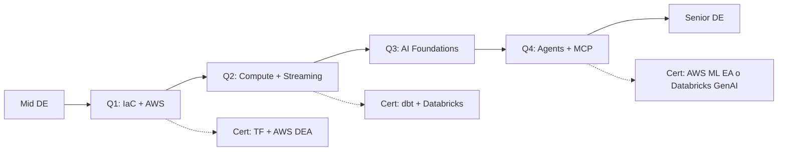

# Semana 1 — Setup total + Anthropic Prompt Engineering primer

> **Inicia: lunes 2026-05-11** · 7 días · ~10.5 h totales
> Cada día: 🎥 ~30min + 📖 ~20min + 💻 ~40min
> 100% recursos gratuitos esta semana (sólo necesitás cuenta AWS Free Tier que no cobra nada)

---

## 🗓 Día 1 — Lunes 2026-05-11 — AWS account + MFA + IAM user

### 🎥 Video (~30 min) — FREE — todos 2025+

**Primary (10 min):** "How to Setup an AWS Account in 10 Minutes | Free Tier & Paid Version Explained" (Jan 2026)
- 🔗 https://www.youtube.com/watch?v=4MgtHuoXBmI
- Walkthrough completo de la consola actualizada

**Complementario (15 min):** "Create AWS Account for Free | AWS Free Tier Setup" (Jan 11, 2026)
- 🔗 https://www.youtube.com/watch?v=IF03Hs-xZRY
- Cubre tips de seguridad post-creación

**Backup (8 min):** "How to Create AWS Free Tier Account (2025)" (Dec 2025)
- 🔗 https://www.youtube.com/watch?v=q2Y7ht1hbXc

**Para el setup de IAM user + MFA específicamente** seguí los **docs oficiales** (siempre actualizados, mejor que YouTube viejo):
- IAM user: https://docs.aws.amazon.com/IAM/latest/UserGuide/id_users_create.html
- MFA virtual: https://docs.aws.amazon.com/IAM/latest/UserGuide/id_credentials_mfa_enable_virtual.html

### 📖 Article (~20 min) — FREE oficial

**1) AWS Well-Architected Framework — Cost Optimization Pillar** (~15 min)
- 🔗 https://docs.aws.amazon.com/wellarchitected/latest/cost-optimization-pillar/welcome.html
- Leer **solo** estas 3 secciones:
  - **"Abstract"** (1 párrafo)
  - **"Introduction"** — entender los 6 pilares + 5 design goals del Cost pillar (Practice Cloud Financial Management, Expenditure and usage awareness, Cost effective resources, Manage demand and supply, Optimize over time)
  - **"Design principles"** (la página siguiente en el menú lateral) — los 5 principios concretos
- ⏱ ~15 min de lectura

**2) AWS Free Tier oficial** (~5 min)
- 🔗 https://aws.amazon.com/free/
- Identificar qué servicios tenés "Always Free" vs "12 months free" vs "Trials"
- Tip: Lambda, DynamoDB, SNS, SQS son **Always Free** con cuotas → usalos sin miedo
- ⚠️ NAT Gateway, EBS volumes, Elastic IPs NO están en free tier → ojo

### 💻 Práctica (~40 min) — Crear cuenta + guardrails

⚠️ **NO uses tu email de Cometa.** Esta es tu cuenta personal de aprendizaje.

**Pasos exactos:**

1. Ir a https://aws.amazon.com/free/ → "Create a Free Account"
2. Email personal + password fuerte (1Password recomendado)
3. Account name: `marko-learning` (o lo que prefieras)
4. Verificar tarjeta de crédito (no se cobra nada en Free Tier; es validación)
5. Plan: **Basic Support – Free**
6. Login a la consola con root account
7. **CRÍTICO — Activar MFA en root** (5 min):
   - Click en tu nombre arriba derecha → Security credentials
   - Multi-factor authentication → Assign MFA device
   - Virtual MFA app → escanear QR con Google Authenticator / 1Password / Authy
   - Verificar con 2 códigos consecutivos
8. **Crear IAM user para uso diario** (10 min):
   - IAM → Users → Create user
   - User name: `marko-dev`
   - ✅ "Provide user access to the AWS Management Console"
   - ✅ "I want to create an IAM user"
   - Custom password autogenerado
   - Permissions: "Attach policies directly" → seleccionar `AdministratorAccess` (solo para learning; en prod usarías least-privilege)
   - Create user
   - Download **CSV con credentials** (lo vas a usar)
9. **Configurar AWS CLI localmente** (5 min):
   - En la cuenta `marko-dev` → Security credentials → Create access key
   - Use case: "Command Line Interface (CLI)"
   - Copiá Access Key ID + Secret Access Key
   - Terminal:
     ```bash
     aws configure --profile marko-dev
     # AWS Access Key ID: AKIA...
     # AWS Secret Access Key: <secret>
     # Default region: us-east-1
     # Default output: json
     
     # Verificar
     aws --profile marko-dev sts get-caller-identity
     # Debe mostrar: "Arn": "arn:aws:iam::XXX:user/marko-dev"
     ```
10. **Logout del root.** Loggeate como `marko-dev` para todo lo siguiente.

**Tarea ESCRITA en LOG.md hoy:**
- Account ID:
- IAM user: marko-dev
- MFA activado: ✅
- AWS CLI profile: `learning`
- Region default: us-east-1

---

## 🗓 Día 2 — Martes 2026-05-12 — Access Keys + Cost guardrails completos

> **Tema del día:** todo lo que protege tu billetera. Access Keys del CLI + 3 Budgets + Anomaly Detection + Cost Allocation Tags.

### 🎥 Video (~30 min) — todos 2025+

**Primary (12 min) — Budgets:** "AWS Budgets Tutorial: How to Set Up Cost Alerts & Notifications for Beginners" (Oct 12, 2025)
- 🔗 https://www.youtube.com/watch?v=vvt-1icxsXk

**Cert prep (15 min) — Budgets:** "AWS Budgets Tutorial: Setup Billing Alerts & Alarms | AWS Solutions Architect Course" (Jan 14, 2026)
- 🔗 https://www.youtube.com/watch?v=MxCCn-jrt4g

**Oficial AWS — Access Keys (atemporal):** AWS docs walkthrough "Managing access keys for IAM users"
- 🔗 https://docs.aws.amazon.com/IAM/latest/UserGuide/id_credentials_access-keys.html

### 📖 Article (~20 min) — FREE oficial

**1) AWS Budgets Best Practices** (~10 min)
- 🔗 https://docs.aws.amazon.com/cost-management/latest/userguide/budgets-best-practices.html
- Cuántos budgets crear, alert thresholds, forecast vs actual

**2) AWS Hands-On Tutorial: Control Costs with Free Tier and Budgets** (~10 min)
- 🔗 https://docs.aws.amazon.com/hands-on/latest/control-your-costs-free-tier-budgets/control-your-costs-free-tier-budgets.html

**Bonus (5 min):** Vantage blog "Top AWS Cost Mistakes" — https://www.vantage.sh/blog (buscar "cost mistakes" o "free tier")

### 💻 Práctica (~50 min) — Cost guardrails de punta a punta

**Parte A: Generar Access Keys + Configurar CLI (10 min)**

1. Loggear como `marko-dev` en la consola (usar URL del CSV de password que descargaste ayer)
2. **IAM → Users → marko-dev → Security credentials tab**
3. Scroll a "Access keys" → **Create access key**
4. Use case: **"Command Line Interface (CLI)"** → Confirm checkbox
5. Description tag: `learning-cli`
6. Click "Create access key" → **Download .csv file**
7. Copialo a `/tmp/`:
   ```bash
   cp ~/Downloads/<nombre-del-nuevo-csv>.csv /tmp/keys.csv
   ```
8. Decime "**keys copiadas**" y yo corro:
   ```bash
   aws configure import --csv file:///tmp/keys.csv
   aws --profile marko-dev sts get-caller-identity  # verificación
   rm /tmp/keys.csv && rm ~/Downloads/<el-csv-de-keys>.csv  # cleanup
   ```

**Parte B: 3 Budgets de protección (15 min)**

En la consola, buscar "Budgets" → Create budget → **Customize (advanced)** → Cost budget

- **Budget #1 — early warning:**
  - Name: `learning-warning`
  - Period: Monthly · Amount: **$5**
  - Alert: actual > 100% → email
- **Budget #2 — action:**
  - Name: `learning-alert`
  - Amount: **$15**
  - Alert: forecast > 100% → email
- **Budget #3 — emergency:**
  - Name: `learning-emergency`
  - Amount: **$25**
  - Alert: actual > 100% → email + SNS topic (crear uno: `cost-alerts`)

**Parte C: Cost Anomaly Detection (10 min)**

- Buscar "Cost Anomaly Detection" → Create monitor
- Monitor type: **AWS services**
- Threshold: **$5** (te avisa si algo se sale del patrón)
- Subscribe email alerts

**Parte D: Cost Allocation Tags (5 min)**

- Buscar "Cost Allocation Tags" en Billing
- Activar "User-defined cost allocation tags": `Project`, `Environment`, `AutoStop`
- (No hace nada solo; vas a tag-ear `Project=learning` en todo recurso desde mañana)

**Parte E: Verificar todo (5 min)**

```bash
# Listar budgets via CLI (debe mostrar 3)
aws --profile marko-dev budgets describe-budgets --account-id $(aws --profile marko-dev sts get-caller-identity --query Account --output text)

# Listar anomaly monitors
aws --profile marko-dev ce get-anomaly-monitors
```

**LOG.md:**
- ✅ Access keys generadas + AWS CLI funcionando (profile `marko-dev`)
- ✅ Budgets: $5/$15/$25
- ✅ Anomaly Detection: $5 threshold
- ✅ Cost Allocation Tags activos
- ✅ CSVs eliminados de Downloads y /tmp/

---

## 🗓 Día 3 — Miércoles 2026-05-13 — Tooling local + tu primer Terraform "Hello World"

> **Tema del día:** instalar todo el toolchain y **usarlo de verdad** — vas a provisionar un S3 bucket con Terraform y lo vas a destruir. Primera vez tocando IaC en producción real.

### 🎥 Video (~30 min) — todos 2025+

**Primary (15 min):** "Install Terraform and Create AWS EC2 Instance | Step-by-Step Beginner Tutorial" (Nov 2025)
- 🔗 https://www.youtube.com/watch?v=tJP5DSfz4xk
- Install + primer recurso AWS

**Complementario (15 min):** "Terraform Tutorial on AWS - Getting Started" (April 2025)
- 🔗 https://www.youtube.com/watch?v=Qfg6hRY4Tq0

### 📖 Article (~20 min) — mix oficial + Medium

**1) HashiCorp Tutorial AWS - Get Started (oficial)** (~10 min)
- 🔗 https://developer.hashicorp.com/terraform/tutorials/aws-get-started
- Páginas: "What is IaC with Terraform?" + "Install Terraform" + "Build infrastructure"

**2) Medium — "Terraform on AWS: The Most Complete Beginner Guide for 2025" — Atmosly** (~8 min)
- 🔗 https://medium.com/atmosly/terraform-on-aws-the-most-complete-beginner-guide-for-2025-f1c2cdf1ed4d
- Cubre IaC fundamentals + EC2 + modules + remote state con perspectiva práctica de ingeniero, no doc oficial seco

**3) Medium — "Beginner to Practical: Hosting an S3 Static Website with Terraform Modules" — Shashank Ray (Dec 2025)** (~5 min)
- 🔗 https://medium.com/@shashankray2053/beginner-to-practical-hosting-an-s3-static-website-with-terraform-modules-26a1b3defc25
- Te muestra cómo escalar de "1 archivo main.tf" → módulos reutilizables (lo que vas a hacer en sem 2)

**Bonus:** LocalStack Overview — https://docs.localstack.cloud/aws/getting-started/installation/

### 💻 Práctica (~50 min)

**Parte A: Instalar toolchain (20 min)**

```bash
# 1. Homebrew (si no lo tenés)
which brew || /bin/bash -c "$(curl -fsSL https://raw.githubusercontent.com/Homebrew/install/HEAD/install.sh)"

# 2. Terraform
brew install hashicorp/tap/terraform
terraform -version  # >=1.6

# 3. Docker Desktop
# Descargá de https://www.docker.com/products/docker-desktop/
docker --version

# 4. LocalStack CLI
brew install localstack/tap/localstack-cli
localstack --version

# 5. Ollama (AI local, para más adelante)
brew install ollama
ollama pull llama3.2:3b  # modelo chico ~2GB

# 6. gh CLI
brew install gh
gh auth login  # Browser flow

# 7. uv (Python package manager moderno)
brew install uv

# 8. Node + tflint + tfsec
brew install node tflint tfsec
```

**Verificá todo:**
```bash
for tool in terraform aws docker ollama gh uv node tflint tfsec; do
  echo -n "$tool: "; command -v $tool >/dev/null && echo "✅" || echo "❌ FALTA"
done
```

**Parte B: Tu primer Terraform Hello World (25 min)**

⚠️ Vamos a crear y destruir 1 S3 bucket real. Costo: **$0** (S3 Free Tier).

```bash
cd ~/Documents/GitHub/de-zero-to-hero/01-iac-terraform/01-foundations
mkdir -p hello-world && cd hello-world

# Crear main.tf
cat > main.tf <<'EOF'
terraform {
  required_version = ">= 1.6"
  required_providers {
    aws = {
      source  = "hashicorp/aws"
      version = "~> 5.0"
    }
  }
}

provider "aws" {
  region  = "us-east-1"
  profile = "marko-dev"

  default_tags {
    tags = {
      Project     = "learning"
      Environment = "dev"
      AutoStop    = "true"
      ManagedBy   = "terraform"
    }
  }
}

# Random suffix para que el bucket name sea único globalmente
resource "random_id" "suffix" {
  byte_length = 4
}

resource "aws_s3_bucket" "hello" {
  bucket = "marko-learning-hello-${random_id.suffix.hex}"
}

resource "aws_s3_bucket_versioning" "hello" {
  bucket = aws_s3_bucket.hello.id
  versioning_configuration {
    status = "Enabled"
  }
}

output "bucket_name" {
  value = aws_s3_bucket.hello.id
}
EOF

# Init (descarga provider AWS)
terraform init

# Plan (preview de qué va a crear)
terraform plan

# Apply (crear de verdad — confirmá con 'yes')
terraform apply

# Verificar en AWS
aws --profile marko-dev s3 ls | grep hello

# IMPORTANTE: destruir antes de seguir (no quema plata pero buena práctica)
terraform destroy

# Confirmar que se fue
aws --profile marko-dev s3 ls | grep hello  # debería estar vacío
```

**Parte C: `.tool-versions` y commit (5 min)**

```bash
cd ~/Documents/GitHub/de-zero-to-hero
cat > .tool-versions <<EOF
terraform 1.10.0
python 3.12.3
node 20.18.0
EOF

# Commit del primer proyecto Terraform funcional
git add 01-iac-terraform/01-foundations/hello-world .tool-versions
git commit -m "feat(iac): primer Terraform hello-world — S3 bucket creado y destruido"
git push  # si ya hiciste git init + remote (sino esto es mañana)
```

**LOG.md:**
- ✅ 10 herramientas instaladas (toolchain completo)
- ✅ Primer `terraform init/plan/apply/destroy` exitoso
- ✅ S3 bucket creado vía IaC y destruido (sin dejar huella)
- 🧠 Insight: el ciclo init → plan → apply → destroy es el corazón de Terraform

---

## 🗓 Día 4 — Jueves 2026-05-14 — Git init + push + LinkedIn announcement

> ✅ Marko adelantó `git init` + 3 commits en Día 3. Lo que queda hoy: `gh repo create --public --push`, LinkedIn post inicial, Cap 1 de Reis.

### 🎥 Walkthrough (~30 min) — FREE — blogs 2025+

⚠️ YouTube de `gh` CLI son 2020-21 (estable). Por eso priorizamos blogs 2025+ y docs oficiales.

**Primary — blog 2025 walkthrough (15 min):** Adam Johnson "Top commands in gh, the official GitHub CLI" (Nov 24, 2025)
- 🔗 https://adamj.eu/tech/2025/11/24/github-top-gh-cli-commands/

**Complementario — blog 2025 (15 min):** "Getting Started with GitHub CLI (gh): GitHub From Your Terminal" (Dec 11, 2025)
- 🔗 https://blogs.reliablepenguin.com/2025/12/11/getting-started-with-github-cli-gh-github-from-your-terminal

### 📖 Article (~20 min) — mix oficial + Medium + libro

**1) GitHub CLI Quickstart (oficial)** (~5 min)
- 🔗 https://docs.github.com/en/github-cli/github-cli/quickstart

**2) Medium — Joe Reis Substack: "What is a Data Engineer?" (atemporal)** (~10 min)
- 🔗 https://joereis.substack.com/
- Si tenés el libro: **Cap 1 "Data Engineering Described"** (págs 1-30) en su lugar

**3) Bonus Medium — "How GitHub CLI changed my workflow" (cualquier artículo reciente 2025)** (~5 min)
- Búsqueda en Medium: "github cli workflow 2025"

### 💻 Práctica (~40 min) — Repo público + LinkedIn

**1. git init y push (15 min):**
```bash
cd ~/Documents/GitHub/de-zero-to-hero

git init
git branch -M main
git add .
git commit -m "feat: bootstrap de-zero-to-hero — Mid → Senior DE 12-month journey"

# Crear repo público en GitHub
gh repo create de-zero-to-hero --public --source=. --description "12-month journey from Mid to Senior Data Engineer. Public progress, daily commits, real projects." --push

# Verificar
gh repo view --web
```

**2. LinkedIn post inicial (15 min):**

Draft (editá a tu gusto):

```
Public commitment.

A partir del lunes 2026-05-11, voy a documentar 1 año de journey
de Mid Data Engineer a Senior DE.

1.5 horas por día. 365 días. Sin bootcamps pagos.

Stack target: Terraform, Airflow desde cero, Spark/Lakehouse,
Kafka, RAG, MCP, fine-tuning, system design.

Repo público (todo el progreso a la vista):
github.com/markotalledo/de-zero-to-hero

5 certs target en el camino:
- HashiCorp Terraform Associate (mes 4)
- AWS Data Engineer Associate (mes 4)
- dbt Analytics Engineer (mes 8)
- Databricks DE Associate (mes 8)
- AWS ML EA o Databricks GenAI Engineer (mes 12)

La consistencia te lleva. La intensidad te quema.

Si te gustaría seguir el journey, dejame un comentario y te
etiqueto en los posts semanales.

#DataEngineering #LearningJourney #PublicCommitment
```

Publicá ahora. Compartí con 3 contactos.

**3. Pin del repo en tu GitHub profile:**
- Tu profile → Customize your pins → seleccionar `de-zero-to-hero`

**LOG.md:**
- Repo público: ✅ link
- LinkedIn post: ✅ link
- GitHub pin: ✅

---

## 🗓 Día 5 — Viernes 2026-05-15 — Anthropic Prompt Engineering Tutorial (parte 1)

### 🎥 Video (~30 min) — FREE oficial 2025

**Primary (30-40 min) — Anthropic oficial:** "Prompting 101 | Code w/ Claude" (San Francisco, May 22, 2025)
- 🔗 https://www.youtube.com/watch?v=ysPbXH0LpIE
- Sesión oficial del Code w/ Claude. Equipo Anthropic enseñando prompting

**Complementario (15-20 min):** "Claude AI Tutorial: The ULTIMATE Guide to Prompt Engineering & Artifacts (2025)"
- 🔗 https://www.youtube.com/watch?v=dG2iFVKdyhs

### 📖 Articles (~20 min) — mix oficial + Medium

**1) "Building effective agents" — Anthropic Engineering oficial** (~10 min)
- 🔗 https://www.anthropic.com/research/building-effective-agents
- THE post de agent patterns. Leer entero.

**2) "Effective context engineering for AI agents" — Anthropic Engineering (2025)** (~10 min)
- 🔗 https://www.anthropic.com/engineering/effective-context-engineering-for-ai-agents
- Cómo curar el "attention budget" del modelo

**3) Medium — "Prompt Engineering with Anthropic Claude" — Promptlayer Blog** (~8 min)
- 🔗 https://blog.promptlayer.com/prompt-engineering-with-anthropic-claude-5399da57461d/
- Patterns prácticos con ejemplos de prod

**4) Prompt Engineering Overview — Claude API Docs oficial** (~5 min)
- 🔗 https://platform.claude.com/docs/en/build-with-claude/prompt-engineering/overview
- Best practices oficiales para Claude 4.x

### 💻 Práctica (~40 min) — Anthropic Prompt Engineering Tutorial chapters 1-3

```bash
cd ~/Documents/GitHub
git clone https://github.com/anthropics/courses.git anthropic-courses
cd anthropic-courses/prompt_engineering_interactive_tutorial/Anthropic\ 1P
```

Hoy hacés **chapters 1-3** (~30-40 min):
- `01_Basic_Prompt_Structure.ipynb`
- `02_Being_Clear_and_Direct.ipynb`
- `03_Assigning_Roles.ipynb`

**Setup necesario:**
```bash
# Crear venv
cd ~/Documents/GitHub/anthropic-courses
uv venv && source .venv/bin/activate
uv pip install anthropic jupyter

# API key Anthropic (generala en https://console.anthropic.com/ → Settings → API Keys)
# Costo total del tutorial completo (9 chapters): ~$0.10 USD usando Claude Haiku
export ANTHROPIC_API_KEY="sk-ant-..."

# Lanzar notebook
jupyter notebook prompt_engineering_interactive_tutorial/Anthropic\ 1P/
```

Completá los exercises de cada chapter. **Tomá notas** de los takeaways en `~/Documents/GitHub/de-zero-to-hero/notes/anthropic-prompt-eng-ch01-03.md`.

**LOG.md:**
- Tutorial chapters: 1, 2, 3 ✅
- Top 3 ideas:
  1. ...
  2. ...
  3. ...

---

## 🗓 Día 6 — 📦 Sábado 2026-05-16 — Excalidraw + primer commit serio

### 🎥 Video (~30 min) — FREE — todos 2025+

**Primary (15 min):** "How to Use Excalidraw for System Design Diagrams (Beginner to Pro Guide)" (July 22, 2025)
- 🔗 https://www.youtube.com/watch?v=TWwjiMRd9hA

**Complementario (10 min):** "Excalidraw Tutorial: How To Use Excalidraw 2025 (Complete Walkthrough)" (Oct 31, 2025)
- 🔗 https://www.youtube.com/watch?v=tjoluusDEts

**Bonus (8 min):** "Design System Diagrams Like Google Engineers (FREE Tool) | Excalidraw" (Feb 4, 2026)
- 🔗 https://www.youtube.com/watch?v=qUnc-vNIM8Q

### 📖 Articles (~20 min) — mix oficial + Medium

**1) Excalidraw — Software Architecture Diagrams (oficial)** (~10 min)
- 🔗 https://plus.excalidraw.com/use-cases/software-architecture-diagram
- Ejemplos de cómo hacer architecture diagrams limpios

**2) Medium — "Mermaid.js vs Excalidraw: Why Text-Based Diagrams Win Long-Term Documentation in 2026" — Activated Thinker** (~8 min)
- 🔗 https://medium.com/activated-thinker/how-one-comment-changed-the-way-i-create-flowcharts-eba4e69eafa9
- Perspectiva práctica: cuándo Mermaid > Excalidraw (y viceversa)

**3) Medium — "Creating Technical Diagrams: Mermaid, PlantUML, Excalidraw" (April 2026)** (~5 min)
- 🔗 https://dasroot.net/posts/2026/04/creating-technical-diagrams-mermaid-plantuml-excalidraw/
- Comparativa de las 3 herramientas con ejemplos

**4) Mermaid intro (oficial)** (~5 min)
- 🔗 https://mermaid.js.org/intro/
- Skim los tipos: flowchart, sequence, classDiagram, gitGraph, C4
- Live editor: https://mermaid.live/

### 💻 Práctica (~40 min) — Diagrama de skills + commit

**1. Crear `architecture.png` para el repo (20 min):**
- Ir a https://excalidraw.com/ (no requiere login)
- Diseñar tu **target skills radar** o **journey roadmap visual**
- Idea: 4 quarters (Q1 IaC, Q2 Compute, Q3 Streaming+AI, Q4 AI Eng) con flechas
- Export → PNG
- Guardar en `~/Documents/GitHub/de-zero-to-hero/docs/journey-map.png`

**2. Mermaid diagram en README (10 min):**
Agregar al README umbrella:


**3. Commit semanal (10 min):**
```bash
git add docs/journey-map.png README.md
git commit -m "feat(week-1): add journey map diagram + skills radar"
git push

# Verificá en GitHub que el diagrama Mermaid renderice bien
gh repo view --web
```

**LOG.md:**
- Diagrama excalidraw: ✅
- Mermaid en README: ✅
- Commit semanal: ✅ link al commit

---

## 🗓 Día 7 — Domingo 2026-05-17 — System Design primer + weekly review

### 🎥 Video (~30 min) — FREE — ByteByteGo channel actualizado

**Primary:** Visitar ByteByteGo YouTube channel y mirar 2 videos cortos recientes (publican semanalmente, todos < 1 año)
- 🔗 https://www.youtube.com/@ByteByteGo
- Sugerencia: filtrá por "Latest" y elegí los 2 más recientes que toquen system design fundamentals

**Backup (siempre actualizado):** ByteByteGo "Scalability Patterns for Modern Distributed Systems"
- 🔗 https://blog.bytebytego.com/p/scalability-patterns-for-modern-distributed

### 📖 Articles (~20 min) — mix ByteByteGo + Medium + GitHub

**1) ByteByteGo: "Latency vs. Throughput" (EP186)** (~8 min)
- 🔗 https://blog.bytebytego.com/p/ep186-latency-vs-throughput

**2) Medium — "How to think about Latency vs Throughput in System Design" — Sagar (May 2026)** (~8 min)
- 🔗 https://medium.com/@sagar.necindia/latency-vs-throughput-system-design-05f7c394eb98
- Reciente, con ejemplos modernos

**3) Medium — "Understanding System Design: Throughput, Latency, CAP Theorem, Availability, Atomicity" — Harsha Agarwal** (~7 min)
- 🔗 https://medium.com/@harshaag99/understanding-system-design-throughput-latency-cap-theorem-availability-and-atomicity-560951f34967
- Mete CAP theorem (preview para Q3 streaming)

**4) ByteByteGo: "Latency numbers you should know" (EP22)** (~3 min skim)
- 🔗 https://blog.bytebytego.com/p/ep22-latency-numbers-you-should-know

**5) System Design Primer (GitHub)** (~3 min skim)
- 🔗 https://github.com/donnemartin/system-design-primer
- Solo: "Index of system design topics" + "Performance vs scalability"

### 💻 Práctica (~40 min) — Weekly review + LinkedIn post

**1. Weekly review en Claude Code (15 min):**
```
/weekly-review
```
Yo audito tu commit del sábado, te ayudo a pulir el README, y draft del LinkedIn post.

**2. Tu primer LinkedIn post de progreso (15 min):**

Template:
```
Semana 1 cerrada del journey 1 año Mid → Senior DE.

Hecho:
✅ AWS account personal con guardrails ($5/$15/$25 budgets)
✅ Toolchain local: TF, Docker, AWS CLI, Ollama, gh, uv
✅ Repo público live: github.com/markotalledo/de-zero-to-hero
✅ Anthropic Prompt Engineering tutorial — chapters 1-3
✅ Primer diagrama de architecture target

Aprendizaje top de la semana:
[1 oración honesta]

Próxima semana: Terraform fundamentals — VPC, IAM, S3 modules.

Y vos? Algo que estás aprendiendo este semestre?

#DataEngineering #Week1 #ContinuousLearning
```

**3. Update tracker en Notion (10 min):**
- Notion page → 52-Week Tracker → Semana 1: status `✅` + link al LinkedIn post

**4. Preview semana 2 (5 min):**
- Abrí `syllabus/Q1-foundations.md` → Semana 2 (Terraform fundamentals)
- Ya sabés qué te toca el lunes

**LOG.md weekly summary:**
```markdown
## Semana 1 — RESUMEN

- Días completados: X/7
- Hours invested: ~X
- Wins:
  1. AWS account + guardrails 100% configurados
  2. Repo público en GitHub con 1 LinkedIn post de impacto
  3. Anthropic API funcionando, primer prompt fine-tuneado
- Stuck on: [si hubo algo]
- Next week priority: Terraform module básico (proyecto 1.1)
- LinkedIn post de cierre: [link]
```

---

## 📊 Cierre de semana 1

Al final del domingo deberías tener:
- ✅ Cuenta AWS personal con MFA + IAM user + budgets
- ✅ 10 herramientas instaladas localmente
- ✅ Repo `de-zero-to-hero` público con 2+ commits
- ✅ 2 LinkedIn posts (lanzamiento + cierre semana 1)
- ✅ Anthropic Prompt Engineering chapters 1-3 completados
- ✅ Cap 1 de Reis "Fundamentals of DE" leído
- ✅ Diagrama excalidraw del journey
- ✅ ~10.5 hours invested

**Próxima semana:** Terraform fundamentals (sem 2). El lunes 2026-05-18 a las 8am corré `/weekly-plan` y te genero la siguiente semana con este mismo nivel de detalle.

---

## 💸 Presupuesto semana 1

| Item | Costo |
|---|---|
| Cuenta AWS Free Tier | $0 |
| Anthropic API key (chapters 1-3) | ~$0.05 |
| Tools (Terraform, Docker, etc.) | $0 (todo OSS) |
| Libro Reis (opcional esta semana, mejor mes 1) | $0-45 |
| **TOTAL semana 1** | **~$0.05** |

Recursos pagos vendrán después con racionalización clara.
